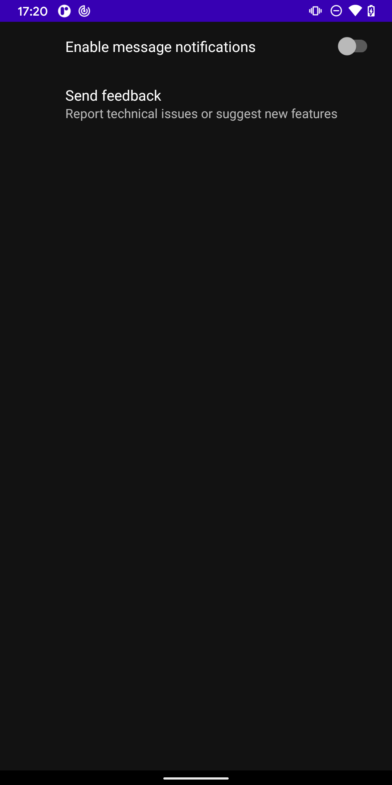
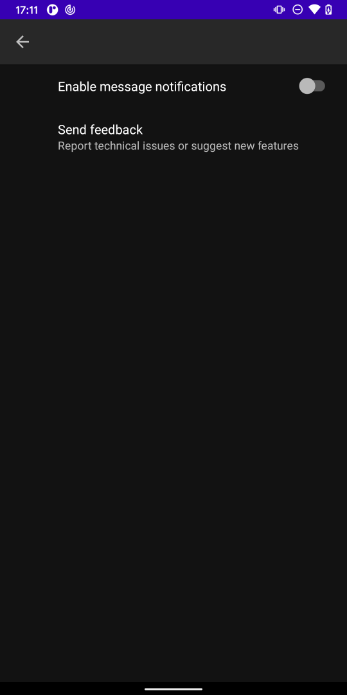

# PreferenceFragmentCompat Custom Layout Sample

|Default|Custom|
|:--:|:--:|
|||

## Layout

The entire preference part seen in Default will be inserted into a FrameLayout whose android:id is "@android:id/list_container".

```xml
<?xml version="1.0" encoding="utf-8"?>
...
<FrameLayout
    android:id="@android:id/list_container"
    android:layout_width="match_parent"
    android:layout_height="match_parent" />
...
```

## Style

Add two items.

```xml
<style name="CustomFragmentCompatStyle" parent="@style/PreferenceFragment.Material">
    <item name="android:layout">@layout/settings_fragment</item>
</style>

<style name="CustomTheme" parent="@style/PreferenceThemeOverlay.v14.Material">
    <item name="preferenceFragmentCompatStyle">@style/CustomFragmentCompatStyle</item>
</style>
```

Add CustomTheme to the activity theme.

```xml
<style name="Theme.Main" parent="Theme.MaterialComponents.DayNight.NoActionBar">
    ...
    <!-- Customize your theme here. -->
    <item name="preferenceTheme">@style/SettingsTheme</item>
</style>
```
